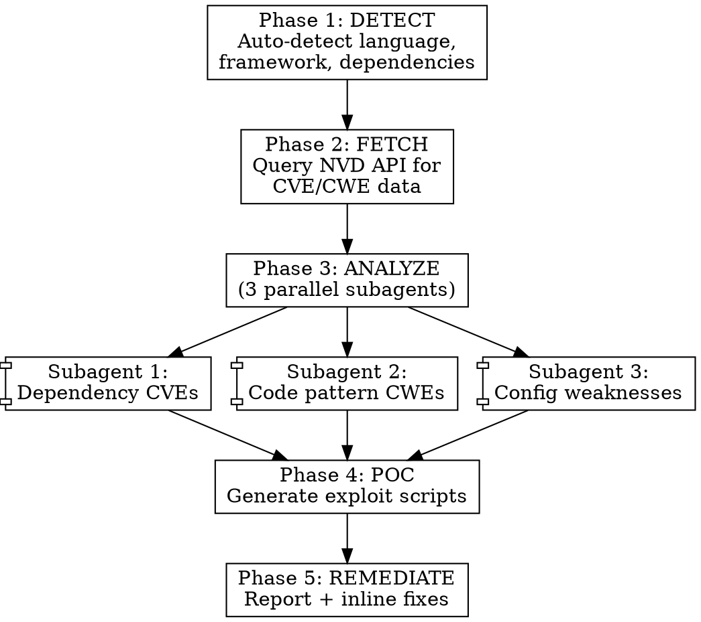

# Security Vulnerability Scanner - Design Spec

**Date**: 2026-04-11
**Status**: Draft
**Project**: SkillCyberPunk

## Context

Security vulnerability analysis is a critical but time-consuming task. Developers need to track CVE/CWE databases, cross-reference them with their project dependencies and code patterns, and then figure out how to reproduce and fix issues. This skill automates the entire pipeline: it fetches real vulnerability data from NVD (NIST), analyzes the target project's code for matching weaknesses, generates proof-of-concept exploit scripts, and applies fixes — all within Claude Code.

The skill is designed for authorized security testing, defensive security, and educational contexts.

## Requirements

1. **Multi-language support**: Auto-detect project stack (Node.js, Python, Go, Rust, Java, PHP, Ruby, C/C++) and tailor analysis accordingly
2. **NVD API integration**: Fetch CVE and CWE data from the official NIST National Vulnerability Database API
3. **Code pattern analysis**: Scan project source code for known vulnerable patterns mapped to CWE entries
4. **Dependency vulnerability check**: Cross-reference project dependencies and versions against known CVEs
5. **PoC generation**: Create executable exploit scripts demonstrating each confirmed vulnerability
6. **Automated remediation**: Generate a Markdown report and apply fixes inline in the source code
7. **User-invocable**: Callable via `/security-vuln-scanner` or triggered when user asks about security/vulnerabilities

## Architecture: Multi-Phase with Subagents

### File Structure

```
~/.claude/skills/security-vuln-scanner/
  SKILL.md                          # Main orchestrator skill
  assets/
    nvd-fetcher.py                  # Python script for NVD API interaction
    cwe-patterns.json               # CWE -> code pattern mapping (multi-language)
    report-template.md              # Markdown template for final report
```

### Operational Flow



## Phase Details

### Phase 1: DETECT (Stack Detection)

**Purpose**: Identify the project's technology stack, languages, frameworks, and dependencies with exact versions.

**How it works**:
- Read project root for manifest files:
  - `package.json` / `package-lock.json` / `yarn.lock` (Node.js)
  - `requirements.txt` / `Pipfile` / `pyproject.toml` / `setup.py` (Python)
  - `go.mod` / `go.sum` (Go)
  - `Cargo.toml` / `Cargo.lock` (Rust)
  - `pom.xml` / `build.gradle` (Java)
  - `composer.json` (PHP)
  - `Gemfile` / `Gemfile.lock` (Ruby)
  - `CMakeLists.txt` / `Makefile` (C/C++)
- Extract: language, framework name, dependency list with versions
- Detect additional signals: Dockerfile, CI configs, `.env` files, config directories

**Multi-language projects**: If the project contains multiple languages (e.g., JS frontend + Python backend), detect ALL stacks and run analysis for each. The `language` field becomes an array, and Phase 2/3 iterate over each stack independently.

**Output**: JSON object with `{ languages: [{language, framework, dependencies: [{name, version}]}], config_files: [...] }`

### Phase 2: FETCH (NVD API Query)

**Purpose**: Retrieve relevant CVE and CWE data from the National Vulnerability Database.

**Implementation**: `nvd-fetcher.py` Python script

**Script interface**:
```
python nvd-fetcher.py \
  --dependencies '{"express": "4.17.1", "lodash": "4.17.20"}' \
  --language javascript \
  --api-key <optional-nvd-api-key> \
  --output /tmp/nvd-results.json
```

**API endpoints used**:
- `GET https://services.nvd.nist.gov/rest/json/cves/2.0?keywordSearch={package_name}` — search CVEs by dependency name
- `GET https://services.nvd.nist.gov/rest/json/cves/2.0?cpeName={cpe}` — search by CPE match for precise version matching
- `GET https://services.nvd.nist.gov/rest/json/cves/2.0?cweId={cwe_id}` — fetch CVEs by CWE category

**Rate limiting**:
- Without API key: 5 requests per 30 seconds
- With API key: 50 requests per 30 seconds
- Script implements exponential backoff and request batching

**Output format**:
```json
{
  "dependency_cves": [
    {
      "cve_id": "CVE-2024-XXXXX",
      "package": "express",
      "affected_versions": "< 4.18.0",
      "installed_version": "4.17.1",
      "cvss_score": 7.5,
      "severity": "HIGH",
      "cwe_ids": ["CWE-79"],
      "description": "...",
      "references": ["..."]
    }
  ],
  "language_cwes": [
    {
      "cwe_id": "CWE-89",
      "name": "SQL Injection",
      "description": "...",
      "applicable_to": "javascript"
    }
  ]
}
```

**API key management**:
- Check environment variable `NVD_API_KEY` first
- Fall back to no-key mode (slower rate limit)
- Skill prompts user about API key on first run if not set

### Phase 3: ANALYZE (Parallel Code Scanning)

**Purpose**: Scan the project source code for actual vulnerabilities matching the fetched CVE/CWE data.

**Execution**: 3 subagents launched in parallel via the Agent tool.

#### Subagent 1: Dependency Vulnerability Matcher

- Takes the `dependency_cves` list from Phase 2
- For each CVE, verifies:
  - Is the installed version actually in the affected range?
  - Is the vulnerable function/feature actually used in the codebase? (grep for import/require/usage)
  - What's the actual exposure? (internal tool vs. public-facing API)
- Output: list of confirmed dependency vulnerabilities with file locations

#### Subagent 2: Code Pattern Scanner (CWE-based)

- Uses `cwe-patterns.json` to search for vulnerable code patterns
- For each relevant CWE, runs Grep with the defined patterns
- Checks context: is the pattern actually vulnerable, or is it already sanitized?
- **Key CWEs scanned**:
  - CWE-89: SQL Injection (raw queries, string concatenation in SQL)
  - CWE-79: XSS (unsanitized user input in templates/DOM)
  - CWE-22: Path Traversal (user input in file paths)
  - CWE-78: OS Command Injection (exec/system with user input)
  - CWE-502: Insecure Deserialization (pickle, eval, unserialize)
  - CWE-798: Hardcoded Credentials (secrets/passwords/tokens in source)
  - CWE-327: Weak Cryptography (MD5, SHA1, DES usage)
  - CWE-611: XML External Entity (XXE)
  - CWE-918: Server-Side Request Forgery (SSRF)
  - CWE-200: Information Exposure (stack traces, debug mode in prod)
  - CWE-352: Cross-Site Request Forgery (missing CSRF tokens)
  - CWE-434: Unrestricted File Upload
  - CWE-862: Missing Authorization
  - CWE-287: Improper Authentication
  - CWE-306: Missing Authentication for Critical Function
  - CWE-732: Incorrect Permission Assignment
  - CWE-400: Uncontrolled Resource Consumption (ReDoS, etc.)
  - CWE-119: Buffer Overflow (C/C++ specific)
  - CWE-416: Use After Free (C/C++ specific)
  - CWE-190: Integer Overflow (C/C++ specific)
- Output: list of code-level vulnerabilities with file:line references

#### Subagent 3: Configuration & Infrastructure Scanner

- Scans for insecure configurations:
  - Missing security headers (CSP, HSTS, X-Frame-Options, etc.)
  - Debug mode enabled in production configs
  - CORS misconfiguration (wildcard origins)
  - Insecure cookie settings (missing Secure/HttpOnly/SameSite)
  - Exposed `.env` files or secrets in version control
  - Weak TLS/SSL configuration
  - Permissive file permissions
  - Docker security (running as root, exposed ports)
  - CI/CD secrets exposure
- Output: list of configuration vulnerabilities with file locations

### Phase 4: POC (Proof-of-Concept Generation)

**Purpose**: For each confirmed vulnerability, generate an executable script that demonstrates the exploit in a controlled local environment.

**Guidelines**:
- Scripts are written in the same language as the target project
- Each PoC is self-contained and clearly commented
- Includes setup instructions (if external services are needed)
- Includes expected output showing the vulnerability is exploitable
- PoC scripts are saved to `security-pocs/` directory in the project root
- Naming convention: `poc-{cve-or-cwe-id}-{short-description}.{ext}`

**Example PoC structure** (Node.js SQL Injection):
```javascript
/**
 * PoC: CWE-89 SQL Injection in src/api/users.js:42
 *
 * This script demonstrates that user input is passed directly
 * into a SQL query without parameterization.
 *
 * Run: node security-pocs/poc-cwe-89-sql-injection.js
 * Expected: The query returns all users instead of just one
 */

// ... exploit code ...
```

**Safety constraints**:
- PoCs target only the local project instance
- No network-facing exploits or remote targets
- No destructive payloads (no data deletion, no file system damage)
- Clear warnings in each script header
- All PoC scripts include a `--dry-run` flag that shows what would happen without executing

### Phase 5: REMEDIATE (Report + Fix)

**Purpose**: Generate comprehensive security report and apply fixes directly in the source code.

**Report file**: `security-report-YYYY-MM-DD.md` in project root.

**Report structure**:

```markdown
# Security Vulnerability Report
**Project**: {project_name}
**Date**: {date}
**Stack**: {language} / {framework}

## Executive Summary
- Critical: X | High: Y | Medium: Z | Low: W
- Dependencies with known CVEs: N
- Code patterns matching CWEs: M
- Configuration issues: K

## Dependency Vulnerabilities
| Package | Version | CVE | CVSS | Severity | Fix Version |
|---------|---------|-----|------|----------|-------------|
| ...     | ...     | ... | ...  | ...      | ...         |

## Code Vulnerabilities
### [CWE-XXX] Vulnerability Name
- **File**: path/to/file.ext:line
- **Severity**: HIGH (CVSS X.X)
- **Description**: ...
- **PoC**: security-pocs/poc-cwe-xxx-name.ext
- **Before** (vulnerable):
  ```lang
  // vulnerable code
  ```
- **After** (fixed):
  ```lang
  // fixed code
  ```

## Configuration Issues
...

## Recommendations
- Priority actions ranked by severity and exploitability
- Best practices for the specific tech stack
```

**Inline fixes**:
- Applied using the Edit tool directly in the source files
- Each fix is explained to the user before being applied
- Dependency fixes: update version in manifest file
- Code fixes: replace vulnerable pattern with secure alternative
- Config fixes: add/modify configuration values

## CWE Pattern Database (`cwe-patterns.json`)

Structure per CWE entry:
```json
{
  "CWE-89": {
    "name": "SQL Injection",
    "severity": "CRITICAL",
    "languages": {
      "javascript": {
        "patterns": [
          "\\bquery\\s*\\(\\s*[`'\"].*\\$\\{",
          "\\bquery\\s*\\(\\s*['\"].*\\+\\s*(?:req\\.|params\\.|query\\.)",
          "\\.raw\\s*\\(\\s*[`'\"].*\\$\\{"
        ],
        "safe_alternatives": [
          "Use parameterized queries: db.query('SELECT * FROM users WHERE id = ?', [userId])",
          "Use an ORM like Sequelize, Prisma, or Knex with bound parameters"
        ],
        "false_positive_signals": [
          "prepared statement",
          "parameterized",
          "\\?.*\\[",
          "\\$\\d+"
        ]
      },
      "python": {
        "patterns": [
          "execute\\s*\\(\\s*f['\"]",
          "execute\\s*\\(\\s*['\"].*%\\s",
          "execute\\s*\\(\\s*['\"].*\\.format\\("
        ],
        "safe_alternatives": [
          "Use parameterized queries: cursor.execute('SELECT * FROM users WHERE id = %s', (user_id,))",
          "Use an ORM like SQLAlchemy or Django ORM"
        ],
        "false_positive_signals": [
          "paramstyle",
          "%s.*,\\s*\\(",
          "\\?.*\\("
        ]
      }
    }
  }
}
```

Each CWE entry contains:
- `name`: Human-readable vulnerability name
- `severity`: CRITICAL / HIGH / MEDIUM / LOW
- `languages`: Per-language detection config
  - `patterns`: Regex patterns to find vulnerable code
  - `safe_alternatives`: Recommended fixes
  - `false_positive_signals`: Patterns that indicate the code is already safe (to reduce noise)

## SKILL.md Design

### Frontmatter
```yaml
---
name: security-vuln-scanner
description: Use when analyzing project security, checking for CVE/CWE vulnerabilities, scanning for insecure code patterns, generating exploit PoCs, or hardening a codebase. Triggers on keywords like "security audit", "vulnerability scan", "CVE", "CWE", "penetration test", "security check", "harden", "exploit", "insecure code"
user-invocable: true
argument-hint: "[project-path]"
---
```

### Skill Body Structure
1. **Overview**: What the skill does in 2-3 sentences
2. **Prerequisites**: NVD API key (optional but recommended), Python 3.8+
3. **Phase Instructions**: Detailed instructions for each of the 5 phases with decision gates
4. **Subagent Prompts**: Exact prompts for the 3 parallel analysis subagents
5. **Red Flags**: Common rationalizations to avoid (e.g., "this pattern is probably fine", "this dependency isn't directly exposed")
6. **Output Requirements**: Report format, PoC naming, fix application rules

## Supported Languages (Initial Release)

| Language   | Dependency Detection | CWE Patterns | PoC Generation |
|------------|---------------------|--------------|----------------|
| JavaScript | package.json, yarn.lock, pnpm-lock | 20 CWEs | Yes |
| TypeScript | package.json, tsconfig.json | 20 CWEs | Yes |
| Python     | requirements.txt, Pipfile, pyproject.toml | 20 CWEs | Yes |
| Go         | go.mod, go.sum | 15 CWEs | Yes |
| Java       | pom.xml, build.gradle | 15 CWEs | Yes |
| Rust       | Cargo.toml, Cargo.lock | 10 CWEs | Yes |
| PHP        | composer.json | 15 CWEs | Yes |
| Ruby       | Gemfile, Gemfile.lock | 15 CWEs | Yes |
| C/C++      | CMakeLists.txt, Makefile | 10 CWEs (memory safety focus) | Yes |

## Verification Plan

### How to test the skill works end-to-end:

1. **Install the skill**: Copy files to `~/.claude/skills/security-vuln-scanner/`
2. **Test on a known-vulnerable project**: Use OWASP Juice Shop, DVWA, or a similar intentionally vulnerable app
3. **Verify Phase 1**: Confirm correct stack detection for at least 3 different language projects
4. **Verify Phase 2**: Confirm NVD API returns valid CVE data (test with and without API key)
5. **Verify Phase 3**: Confirm subagents find expected vulnerabilities in test projects
6. **Verify Phase 4**: Confirm PoC scripts are generated and runnable
7. **Verify Phase 5**: Confirm report is generated with correct format and fixes are applied correctly
8. **False positive test**: Run on a well-secured project and verify minimal false positives
9. **Rate limit test**: Verify NVD API rate limiting works correctly (no 403 errors)
